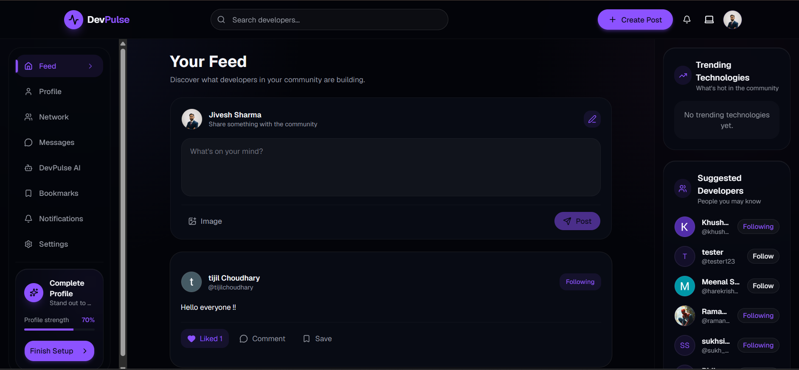
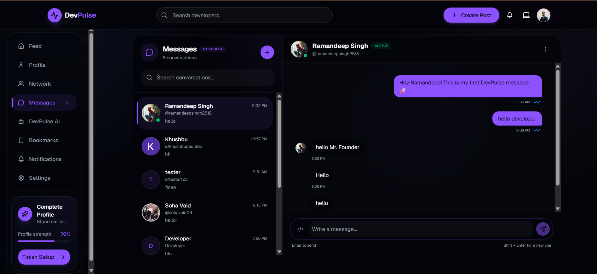
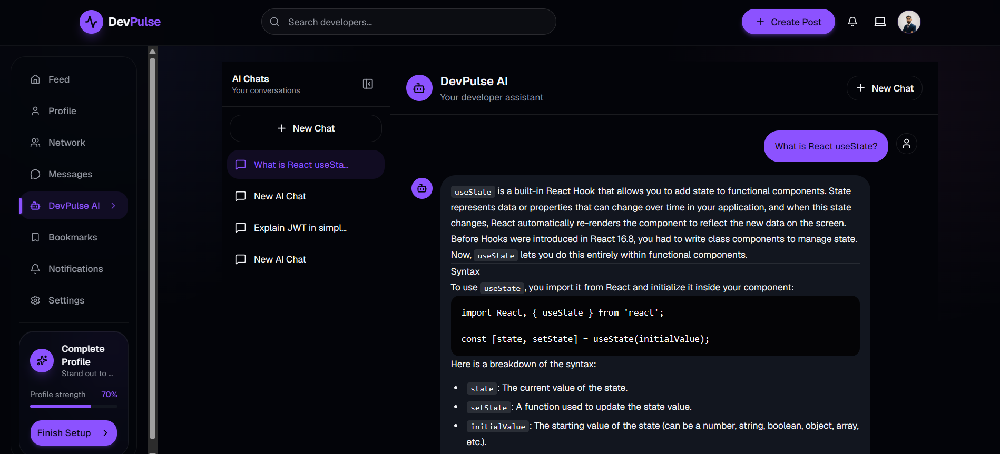
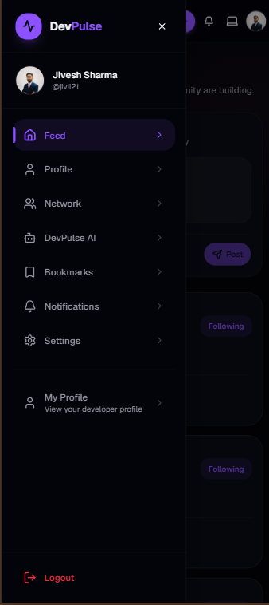

# DevPulse 🚀

> A full-stack developer social platform built with the MERN stack, featuring secure authentication, real-time messaging, notifications, and an AI-powered developer assistant.

## 🌐 Live Demo

**Frontend:** https://devpulse-sf3s.vercel.app/

**Backend:** https://devpulse-backend-4vvo.onrender.com/

---

## 📌 Overview

DevPulse is a developer-focused social platform designed to help developers connect, share knowledge, communicate in real time, and access AI assistance from one place.

The project goes beyond a basic CRUD application by implementing production-oriented features including JWT authentication, Google OAuth, two-factor authentication, real-time communication with Socket.IO, notifications, cloud image storage, and an integrated AI assistant.

---

## ✨ Features

### 🔐 Authentication & Security

- User registration and login
- JWT authentication
- Access token and refresh token architecture
- HTTP-only authentication cookies
- Automatic token refresh
- Google OAuth
- Email verification
- Forgot password and password reset
- Two-factor authentication (2FA)
- Secure logout
- Protected API routes
- Request validation and authorization

### 👨‍💻 Developer Profiles

- Developer profiles
- Bio and skills
- GitHub, LinkedIn and personal website
- Experience and education
- Certificates
- Profile avatar
- Cover image
- Developer search
- Suggested developers

### 📝 Social Feed

- Create posts
- Edit posts
- Delete posts
- Image posts
- Hashtag extraction
- Paginated feed
- User-specific posts
- Likes
- Comments
- Bookmarks

### 🤝 Developer Network

- Follow developers
- Unfollow developers
- Followers and following
- Follow status
- Developer discovery
- Suggested developers

### 💬 Real-Time Messaging

- One-to-one conversations
- Real-time messaging with Socket.IO
- Private user rooms
- Message history
- Read receipts
- Typing indicators
- Real-time message delivery

### 🔔 Notifications

Real-time notifications for:

- Likes
- Comments
- Follows
- Messages
- Other platform activity

### 🤖 DevPulse AI

DevPulse includes an integrated AI assistant for developers.

Features include:

- AI-powered conversations
- Persistent AI conversations
- AI usage tracking
- Token/usage management
- Dedicated AI interface
- Desktop and mobile access

### ☁️ Cloud Media

- Image uploads
- Cloudinary integration
- Post images
- Profile avatars
- Cover images

### 📱 Responsive Design

DevPulse is designed for:

- Desktop
- Tablet
- Mobile

The mobile navigation also provides access to DevPulse AI and the rest of the platform.

---
## 📸 Screenshots

### Feed



### Real-Time Messaging



### DevPulse AI



### Mobile Experience



---

## 🛠️ Tech Stack

### Frontend

- React
- Vite
- React Router
- Axios
- TanStack Query
- Tailwind CSS
- shadcn/ui
- Lucide React
- Socket.IO Client

### Backend

- Node.js
- Express.js
- MongoDB
- Mongoose
- Socket.IO
- JWT
- Google OAuth
- Nodemailer
- Cloudinary

### AI

- AI API integration
- Persistent AI conversations
- Usage and token tracking

### Deployment

- Vercel — Frontend
- Render — Backend
- MongoDB Atlas — Database
- Cloudinary — Media storage

---

## 🏗️ Architecture

DevPulse follows a modular full-stack architecture.

```text
Frontend
   │
   │ HTTP / WebSocket
   ▼
Backend API
   │
   ├── Controllers
   ├── Services
   ├── Middleware
   ├── Validators
   ├── Socket.IO
   │
   ▼
MongoDB